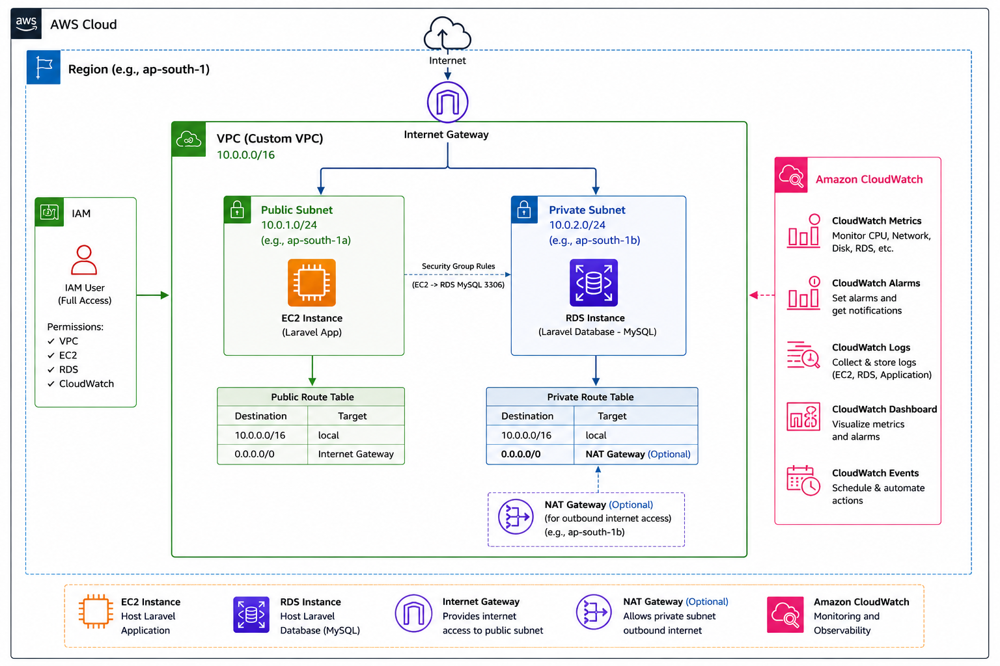

# TaskManager

## Architecture Diagram




## AWS Laravel Production Deployment Architecture

This project demonstrates a production-ready Laravel application deployment on AWS cloud infrastructure using a custom VPC architecture.

The infrastructure includes a secure network setup with IAM, VPC, EC2, RDS, Route Tables, Internet Gateway, Security Groups, and CloudWatch monitoring.

### Architecture Overview

- Created a custom AWS VPC with isolated network environment.
- Configured public and private subnets for secure resource separation.
- Deployed Laravel application on EC2 instance inside the public subnet.
- Hosted MySQL database using Amazon RDS inside the private subnet.
- Configured Internet Gateway to provide internet access to public resources.
- Configured Route Tables for public and private subnet traffic management.
- Implemented Security Groups to allow secure communication between EC2 and RDS.
- Created IAM user and assigned required permissions for AWS resource management.
- Integrated Amazon CloudWatch for monitoring EC2 and RDS metrics, logs, and alarms.

### AWS Services Used

- Amazon VPC
- Amazon EC2
- Amazon RDS (MySQL)
- AWS IAM
- Internet Gateway
- Route Tables
- Security Groups
- Amazon CloudWatch

### Deployment Flow

User → Internet → Internet Gateway → EC2 (Laravel Application) → RDS (Private Database)

This architecture follows AWS best practices by keeping the database private while allowing the application layer to remain accessible through the public subnet.
```

یہ CV/project GitHub README کے لیے بھی professional لگے گا.
